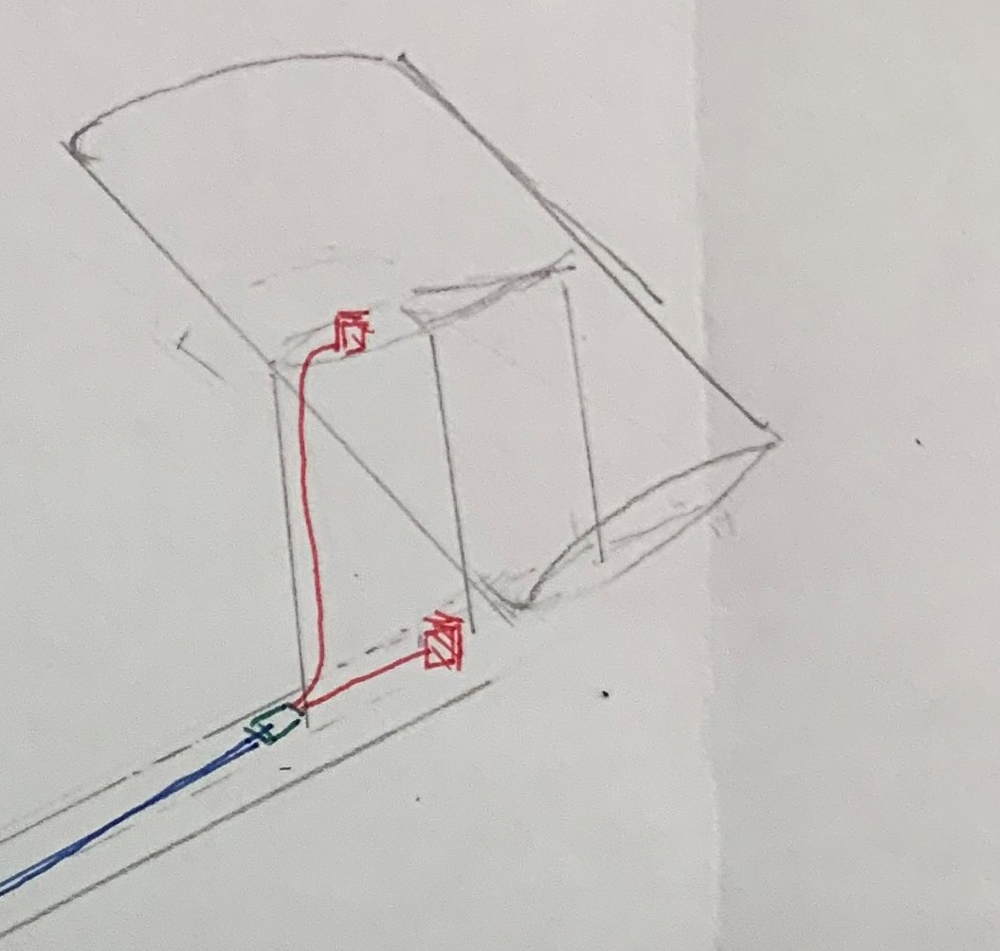
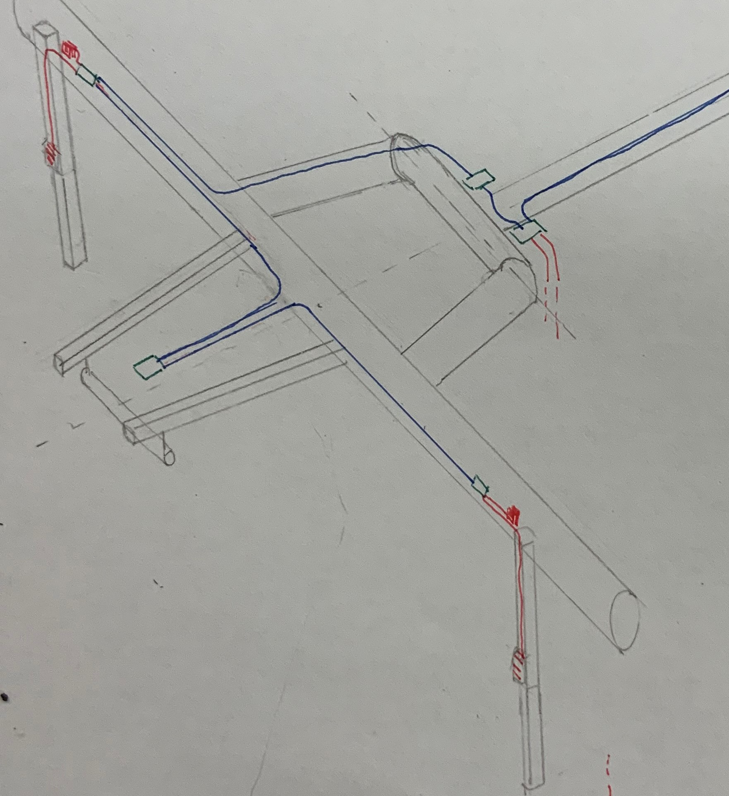
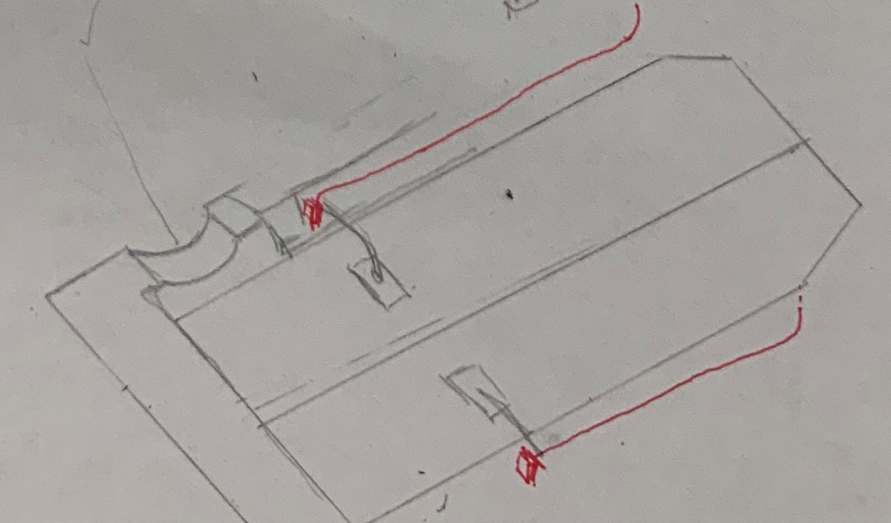
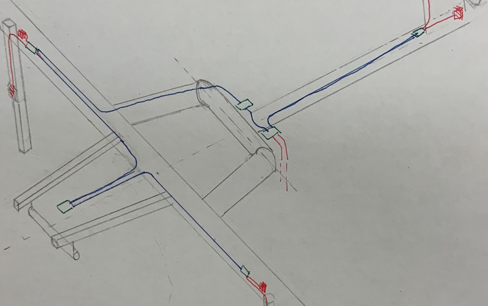
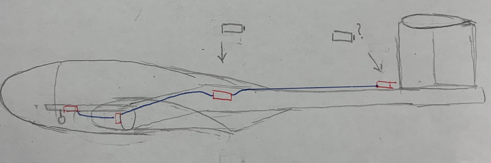
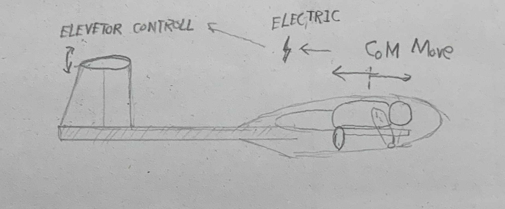
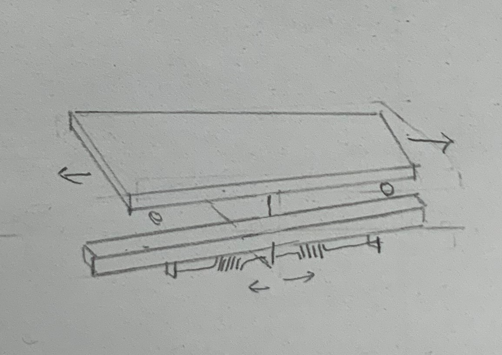
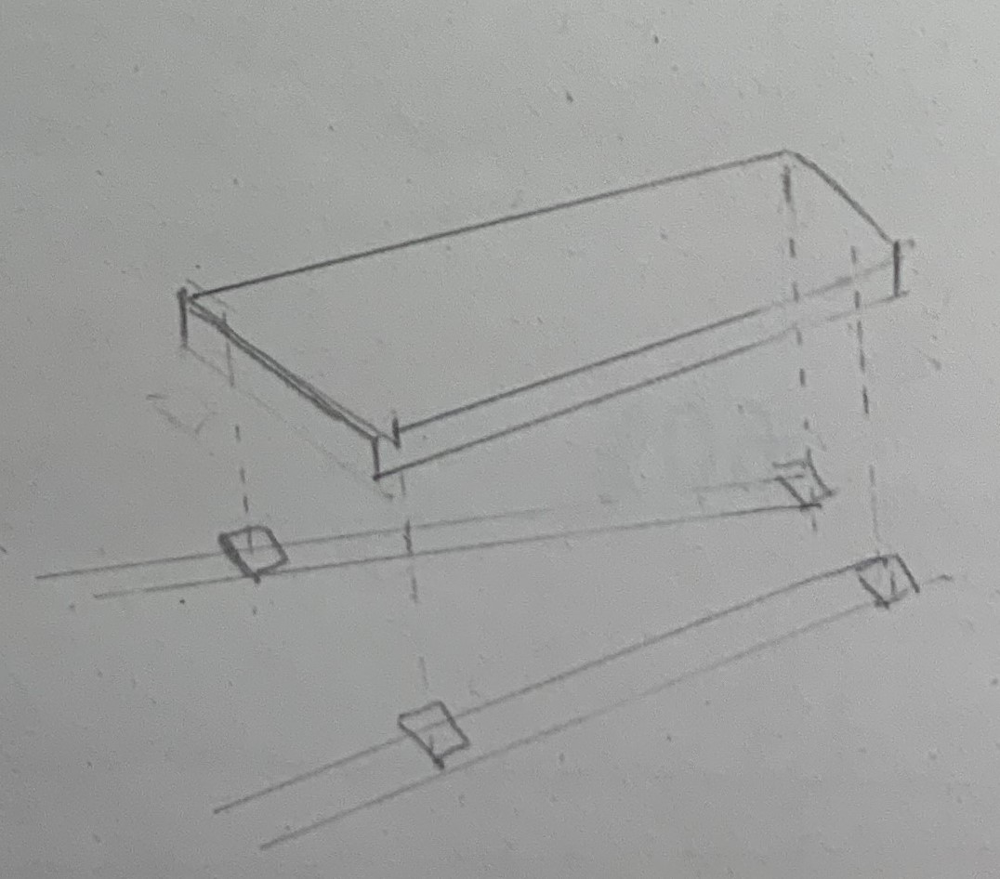

---

---

# (仮称)QX-20
# 電装設計
10/23

---

 ## 昨年からの変更点
 ## 検討中の機構

---

## 昨年からの変更点

---

### 尾翼部

+ 垂直に加え、水平をサーボモータで動作
+ 制御基板を尾翼に接近

---

### 脚

+ 格納、伸縮のモータを見直し中
+ 左右の制御基板を分離して搭載

---

### 蓋

+ 制御基板を脚部から分離

---

### 配線

+ ネットワーク化
	+ 配線の簡略化、作業の高速化
	+ 機能追加が容易に

---

### 電源
+ 乾電池->リチウムイオン
	+ 重さと電力の両立
	+ コストはほぼ同じ

---

## 検討中の機構

+  電池の搭載位置
+  GSHV

---

### 電池の搭載位置

+ 機体前部に１つ
+ 機体前後に１つづつ

---

#### 機体前部に１つ
+ 整備性が高い
+ 機体のバランスに良い
+ 胴体の配線が切れると墜落する
	+ 尾翼を保持できなくなる為

---

#### 機体前後に１つづつ
+ 冗長性がある
	+ 後部の電池が生きていれば、胴体配線が切れても尾翼を保持できる
+ 機体のバランスに悪影響
+ 整備性に問題
	+ 機体後部の電池の固定が難点

---

| 評価軸 | 機体前部に１つ | 機体前後に１つづつ |
| :---: | :-: | :-: |
| 整備性 | ○  | ×  |
| 冗長性 | ×  | ◎ |
|バランス| ○  | ×  |

---

### (仮称)GSHV

---

ここからは機密でお願いします。

---

### GSHV
center of Gravity - Steering Hybrid

重心移動を検知、水平尾翼を稼働

---

### GSHVのニーズ

+ パイロットに対して機体が重い
	+ 重心移動が効きにくい
+ 重心移動の線形性の確保
	+ 上げ方向は効きすぎ、下げ方向は効きにくい
+ 舵でパイロットの重心移動をアシスト

---

### GSHVで検討中の事項

+ パイロットの重心移動を検知するシステム
	+ スライドレール方式
	+ 荷重センサ方式

---

#### スライドレール方式

+ 移動量を検知
+ 機構が複雑
---

#### 荷重センサ方式

+ 荷重の移動を検知
	+ 傾斜に対する補正が必要
+ 機構は単純
